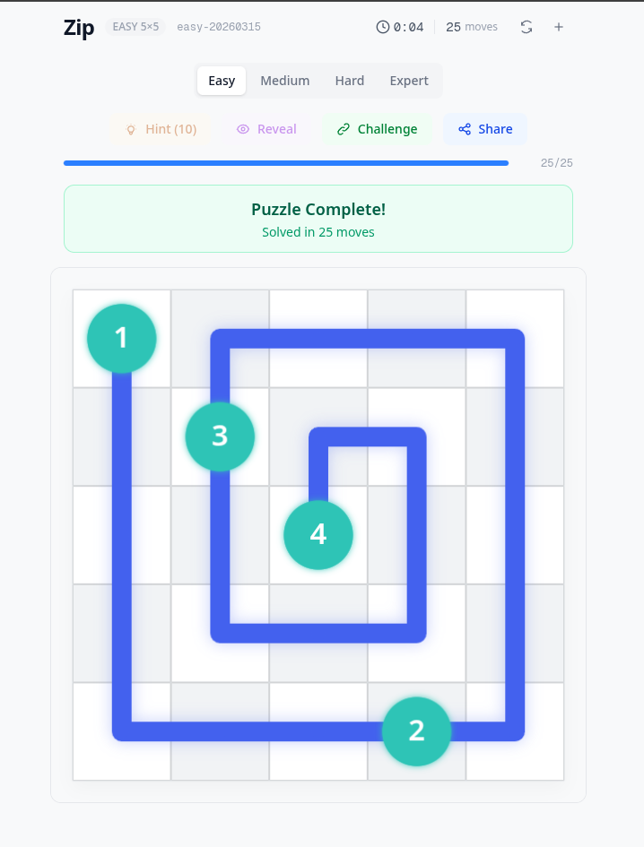

<p align="center">
  <a href="https://zip-game.vercel.app/?seed=medium-1337">
    
  </a>
</p>
<h1 align="center">
  ⚡ ZIP ⚡
</h1>
<h3 align="center">
  A path-drawing puzzle game where every cell matters.
</h3>


# About

Inspired by the [LinkedIn Zip game](https://www.linkedin.com/games/zip/) — built entirely using [Claude Opus 4.6](https://www.anthropic.com/claude) as the AI coding assistant. Zero game libraries. Zero animation frameworks. Just Next.js, Canvas, and a lot of math.

> Draw a single path that visits every cell on the grid — but you must hit the numbered checkpoints in order. Sounds simple. It's not.

---

## 🎮 How to Play

### The Goal

Fill **every cell** on the grid by drawing one continuous path. That's it. That's the whole game.

...except the numbered checkpoints scattered across the board must be crossed **in strictly increasing order** (1 → 2 → 3 → ...). Miss one, skip one, or hit them out of order? The game won't let you.

### The Rules

| Rule                     | What it means                                                          |
| ------------------------ | ---------------------------------------------------------------------- |
| **One path**             | Your line can't branch or overlap — each cell is visited exactly once  |
| **Adjacent moves**       | You can only move to cells that share an edge (no diagonals)           |
| **Checkpoints in order** | Numbered cells must be reached in sequence: 1 first, then 2, then 3... |
| **Walls block you**      | Dark cells are walls — you can't pass through them                     |
| **Every cell counts**    | The puzzle isn't solved until every non-wall cell is part of your path |

### Controls

- **Drag** across cells to draw your path
- **Drag backward** to undo moves (backtrack along your path)
- **Tap a previous cell** to truncate your path back to that point
- **Long press** to use a hint (reveals the next correct cell)
- **Hint button** — same as long press, limited per difficulty
- **Reveal** — watch the full solution animate step-by-step

### Tips & Strategy

1. **Start from checkpoint 1** — you have to. The game enforces it.
2. **Look ahead** — before drawing, scan where checkpoints 2, 3, 4... are located. Plan your route.
3. **Corners and edges first** — cells in corners have fewer exits. Handle them early or you'll get stuck.
4. **Use the orange ping** — if you've hit all checkpoints but cells remain empty, they'll flash orange to show you what's missing.
5. **Don't waste hints** — you get a limited budget per difficulty. Save them for when you're truly stuck.

---

## 🧩 Difficulty Levels

| Level      | Grid  | Checkpoints | Hints |
| ---------- | ----- | ----------- | ----- |
| **Easy**   | 5×5   | 3–5         | 10    |
| **Medium** | 7×7   | 4–7         | 14    |
| **Hard**   | 9×9   | 6–14        | 18    |
| **Expert** | 12×12 | 10–32       | 24    |

More checkpoints = more constraints = harder to find a valid Hamiltonian path. Expert grids with 32 checkpoints are no joke.

---

## 🔗 Challenge Your Friends

Solved a tricky puzzle? Hit the **Challenge** button to generate a shareable URL. Anyone who opens it gets the exact same puzzle (same seed, same grid, same suffering).

The **Share** button copies your solve stats:

```
Zip 7×7 — medium-1337
Moves: 52 | Time: 2:14
```

---

## 🏗️ Tech Stack

|               |                                             |
| ------------- | ------------------------------------------- |
| **Framework** | Next.js 16 (App Router)                     |
| **UI**        | React 19                                    |
| **Language**  | TypeScript 5                                |
| **Styling**   | Tailwind CSS 4                              |
| **Rendering** | HTML5 Canvas — no game engine               |
| **Animation** | Hand-rolled easing, particles, and pulses   |
| **State**     | Pure functional reducers with `useState`    |
| **PRNG**      | Seeded mulberry32 for deterministic puzzles |

**Zero runtime dependencies** beyond React and Next.js. No Redux. No Zustand. No Framer Motion. No Pixi.js. Everything — from the confetti particles to the 3D tilt effect — is built from scratch.

---

## 🧠 How It Works Under the Hood

### Puzzle Generation

1. A **Hamiltonian path** is generated using [Warnsdorff's heuristic](https://en.wikipedia.org/wiki/Knight%27s_tour#Warnsdorf's_rule) with random tie-breaking (seeded PRNG ensures reproducibility)
2. **Checkpoints** are placed at evenly-distributed positions along the path and numbered sequentially
3. A **backtracking solver** with BFS connectivity pruning validates the puzzle and powers the hint system

### Rendering Pipeline

The canvas renderer uses a layered drawing approach:

- **Layer 0:** Cached static grid (off-screen canvas for performance)
- **Layer 1:** Cell highlights (hover, hints, invalid feedback)
- **Layer 2:** Path with animated extension and glow effects
- **Layer 3:** Checkpoint circles with pulse animations
- **Layer 4:** Confetti particle system (on solve)
- **Layer 5:** 3D perspective tilt with bounce-in (on solve)

### Input System

A unified `PointerController` handles mouse and touch events with:

- Drag-to-draw path following
- Automatic backtrack detection
- Long-press for hints
- Tilt-aware coordinate correction (because the canvas is skewed on solve)

---

## 🚀 Getting Started

```bash
# Clone
git clone https://github.com/brunos3d/zip.git
cd zip

# Install
npm install

# Dev server
npm run dev
```

Open [http://localhost:3000](http://localhost:3000) and start drawing.

### Build for Production

```bash
npm run build
npm start
```

---

## 📁 Project Structure

```
src/
├── app/                  # Next.js App Router (layout + page)
├── components/
│   ├── zip-game.tsx      # Main game orchestrator
│   ├── game-canvas.tsx   # Canvas + animation loop + input binding
│   ├── top-bar.tsx       # Timer, moves, seed, reset
│   └── controls.tsx      # Difficulty picker, hints, share, reveal
├── engine/
│   ├── types.ts          # Core types & difficulty config
│   ├── grid-utils.ts     # Grid math, adjacency, seeded PRNG
│   ├── puzzle-generator.ts  # Hamiltonian path + checkpoint placement
│   └── puzzle-solver.ts  # Backtracking solver + hint engine
├── input/
│   └── pointer-controller.ts  # Unified mouse/touch/long-press
├── render/
│   ├── canvas-renderer.ts  # Full rendering pipeline + theme
│   ├── animations.ts       # Pulses, confetti, pings, glows
│   └── tilt.ts             # 3D skew with bounce animation
└── state/
    └── game-store.ts     # Pure functional game logic
```

---

## 🤖 The AI Experiment

This entire project — from the Hamiltonian path generator to the confetti particles — was built using **10 prompts** with **Claude Opus 4.6**. No manual coding. No copy-pasting from Stack Overflow. Just iterative prompt engineering to go from "build me a Zip game" to a fully polished puzzle experience.

It's a proof of what's possible when you pair a clear vision with a capable AI coding assistant.

---

## 📝 License

MIT
